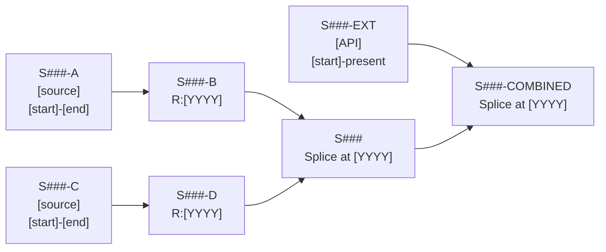

# Series Decomposition: S### — [SERIES NAME]

## Quick Reference

| Field | Value |
|-------|-------|
| Series ID | S### |
| Name | [SERIES NAME] |
| Chapter | [N] |
| Figures | [Fig#.#] |
| Chopped File | [filename.csv] |
| Year Range | [start]-[end] |
| Subseries Count | [N] |
| Extension Source | [API:SERIES_ID or None] |

---

## Sub-Component Table

| Subseries ID | Name | Source | Period | Units | Reindexed? | Derived From | Transform |
|-------------|------|--------|--------|-------|------------|-------------|-----------|
| S###-A | [name] | [source] | [start]-[end] | [units] | No | — | — |
| S###-B | [name] | Derived | [start]-[end] | [units] | Yes (R:[YYYY]) | S###-A | reindex to [YYYY]=100 |
| S### | Final series | Splice | [start]-[end] | [units] | — | — | splice(S###-B, S###-D, at=[YYYY]) |
| S###-EXT | Extension | [API] | [start]-present | [units] | No | — | annual_average |
| S###-COMBINED | Combined | Splice | [start]-present | [units] | — | — | splice(S###, S###-EXT, at=[YYYY]) |

---

## Construction Steps

| Step | Operation | Input | Output | Parameters | Formula |
|------|-----------|-------|--------|------------|---------|
| 1 | load | [source file] | S###-A | — | — |
| 2 | reindex | S###-A | S###-B | base_year=[YYYY] | S###-B[t] = S###-A[t] * (100 / S###-A[[YYYY]]) |
| 3 | load | [source file] | S###-C | — | — |
| 4 | reindex_to_match | S###-C | S###-D | match_to=S###-B, at_year=[YYYY] | S###-D[t] = S###-C[t] * (S###-B[[YYYY]] / S###-C[[YYYY]]) |
| 5 | splice | S###-B, S###-D | S### | at_year=[YYYY] | Use S###-B for t < [YYYY], S###-D for t >= [YYYY] |

---

## Research Entry References

| Entry ID | Type | Quote (excerpt) | Subseries |
|----------|------|-----------------|-----------|
| R001 | methodology_description | "[quote]..." | S###-A, S###-B |
| R002 | source_citation | "[quote]..." | S###-C |

Full research: `Technical/research/S###_research.json`

---

## Modern API Extension

| Field | Value |
|-------|-------|
| API | [FRED/BEA/BLS/MeasuringWorth] |
| Series ID | [API_SERIES_ID] |
| Frequency | [monthly/quarterly/annual] |
| Aggregation | [annual_average/sum/end_of_period] |
| Splice Year | [YYYY] |
| Splice Method | [growth_rate/level_shift/direct] |
| Target Base | [YYYY]=100 |

---

## Construction Diagram

---

*Generated from Anu Ingestion v3.0 — Series Decomposition Template*
